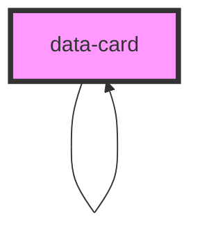

# data-card

<!-- Auto Generated Below -->

## Properties

| Property       | Attribute       | Description | Type                                          | Default     |
| -------------- | --------------- | ----------- | --------------------------------------------- | ----------- |
| `background`   | `background`    |             | `"light"`                                     | `undefined` |
| `bodyText`     | `body-text`     |             | `string \| { value: string; label: string; }` | `undefined` |
| `childrenData` | `children-data` |             | `DataCard[] \| string`                        | `undefined` |
| `dataTitle`    | `data-title`    |             | `string \| { value: string; label: string; }` | `undefined` |
| `downloadUrl`  | `download-url`  |             | `string`                                      | `undefined` |
| `downloads`    | `downloads`     |             | `DownloadObj[] \| string`                     | `undefined` |
| `imageUrl`     | `image-url`     |             | `string`                                      | `undefined` |
| `metadata`     | --              |             | `(ValueLabelObj \| ValueLabelObjWithUrl)[]`   | `undefined` |
| `subTitle`     | `sub-title`     |             | `string \| { value: string; label: string; }` | `undefined` |
| `tags`         | `tags`          |             | `Tag[] \| string`                             | `undefined` |
| `textRight`    | `text-right`    |             | `string \| { value: string; label: string; }` | `undefined` |
| `variant`      | `variant`       |             | `"default" \| "detailed" \| "minimal"`        | `'default'` |

## Events

| Event      | Description | Type                                 |
| ---------- | ----------- | ------------------------------------ |
| `editData` |             | `CustomEvent<{ object: DataCard; }>` |

## Dependencies

### Used by

 - [data-card](.)

### Depends on

- [data-card](.)

### Graph

----------------------------------------------

*Built with [StencilJS](https://stenciljs.com/)*
