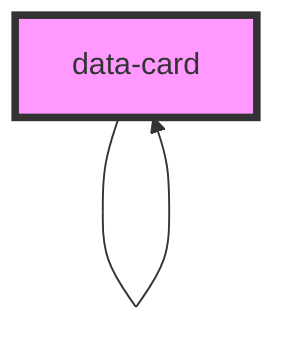

# data-card

<!-- Auto Generated Below -->

## Properties

| Property          | Attribute          | Description                                                        | Type                                                  | Default     |
| ----------------- | ------------------ | ------------------------------------------------------------------ | ----------------------------------------------------- | ----------- |
| `actionButtons`   | `action-buttons`   | Array of action buttons to be displayed on the card                | `ActionButtonInterface[] \| string`                   | `undefined` |
| `bodyText`        | `body-text`        | Body text of the card                                              | `string \| { value: string; label: string; }`         | `undefined` |
| `childrenData`    | `children-data`    | Array of children cards to be displayed on the card                | `DataCard[] \| string`                                | `undefined` |
| `childrenLabel`   | `children-label`   | Clickable label to display when the card has children              | `string`                                              | `undefined` |
| `childrenVariant` | `children-variant` | Variant of the card's children                                     | `"default" \| "minimal"`                              | `'minimal'` |
| `dataTitle`       | `data-title`       | Title of the card                                                  | `string \| { value: string; label: string; }`         | `undefined` |
| `imageUrl`        | `image-url`        | URL of the image to be displayed on the card                       | `string`                                              | `undefined` |
| `metadata`        | `metadata`         | Array of metadata to be displayed on the card in the detailed view | `(ValueLabelObj \| ValueLabelObjWithUrl)[] \| string` | `undefined` |
| `nested`          | `nested`           | Whether the card is being used inside of the detailed view         | `boolean`                                             | `false`     |
| `subTitle`        | `sub-title`        | Subtitle of the card                                               | `string \| { value: string; label: string; }`         | `undefined` |
| `tags`            | `tags`             | Array of tags to be displayed on the card                          | `Tag[] \| string`                                     | `undefined` |
| `textRight`       | `text-right`       | Text to be displayed on the right of the card                      | `string \| { value: string; label: string; }`         | `undefined` |
| `variant`         | `variant`          | Variant of the card                                                | `"default" \| "detailed" \| "minimal"`                | `'default'` |

## Events

| Event         | Description                                    | Type                                                              |
| ------------- | ---------------------------------------------- | ----------------------------------------------------------------- |
| `actionClick` | Event emitted when an action button is clicked | `CustomEvent<{ eventIdentifier: string; dataObject: DataCard; }>` |

## Shadow Parts

| Part                                    | Description |
| --------------------------------------- | ----------- |
| `"card-container"`                      |             |
| `"detailed-card-container"`             |             |
| `"detailed-image-wrapper"`              |             |
| `"detailed-main-card"`                  |             |
| `"detailed-metadata-container"`         |             |
| `"detailed-metadata-content-container"` |             |
| `"image-wrapper"`                       |             |
| `"minimal-card-container"`              |             |

## Dependencies

### Used by

 - [data-card](.)

### Depends on

- [data-card](.)

### Graph

----------------------------------------------

*Built with [StencilJS](https://stenciljs.com/)*
